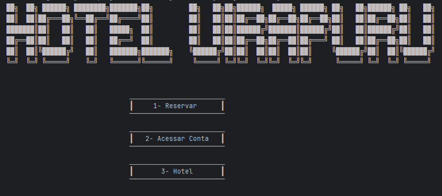
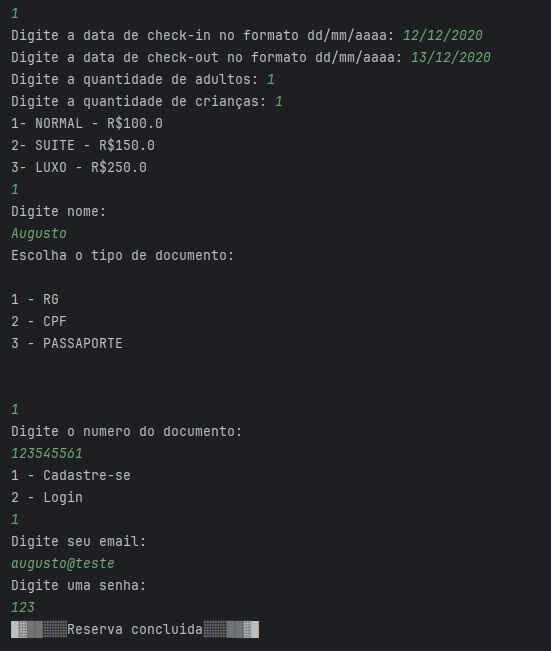
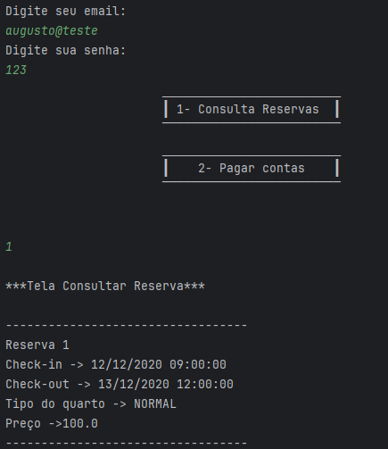

# README - Sistema Hotel Uirapuru

## Grupo

- **Integrantes**: Augusto Serrano, Caio Lopes, Eduar Carvalho, Lucas Alcantara
- **Curso**: Tecnologia em Sistemas para Internet
- **Disciplina**: Introdução a Orientação a Objeto (INOO)
- **Professor**: Ednilson Rossi

## Estratégia de Desenvolvimento

Este projeto foi feito utilizando métodos ágeis através de um quadro KanBan no Trello para a divisão correta das tarefas de cada integrante. Sempre mantendo o máximo de comunicação e estando sempre conectado online enquanto estiver codando.
Primeiramente, todos em conjunto, desenvolveram o diagrama de classes do projeto, para que seu entendimento fosse 100% claro para cada integrante.
Augusto e Eduardo foram os encarregados a criar o model completo do código, enquanto isso, Caio e Lucas começaram a pensar e codar como seria a implementação da View. No qual ambos optaram por criar uma API em Java para que a view seja implementada em um site Web baseado em mobile first, tudo isso para que o acesso do cliente seja agradável.

## Comunicação e Auxílio

Conexões diárias no Discord para esclarescer e mostrar todas as novas adições do dia. Possuindo sempre respeito e entendimento de todas as ideias

## O Sistema

O sistema apresentado neste repositório possui sua view aplicada apenas no terminal, para que a compreensão do software seja fácil e para que compilação e execução do código seja mais simplificada.
Caso queira acessar a Implementação do sistema com o WebVIew acesse: https://github.com/caioslopes/webapp_Hotel_Uirapuru e https://github.com/EduardoPC05/API_HotelUirapuru

## Compilação e Execução

Para compilar e executar o sistema:
1. Certifique-se de ter o JDK (Java Development Kit) instalado em sua máquina.
2. Abra o IDE de sua preferência ou utilize um terminal.
3. Navegue até o diretório do projeto.
4. Localize a classe `Main` no pacote `view`.
5. Execute a classe `Main` para iniciar a aplicação.

## Screenshots

## Diagrama de Classes (opcional)

UML - https://miro.com/app/board/uXjVNE8dw-U=/?share_link_id=136979358040